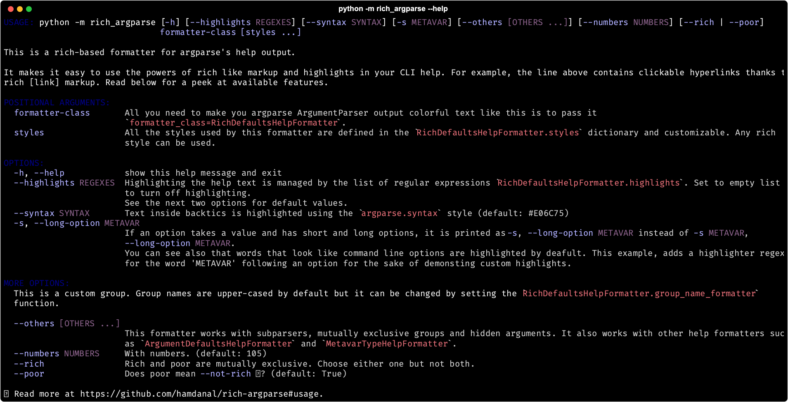

# rich-argparse-plus

Format **argparse** help output with [**rich**](https://pypi.org/project/rich).

Forked from [rich-argparse](https://github.com/hamdanal/rich-argparse)) so check there to see the details.  This version adds a few features:

1. **Render to various image/web formats by setting an variable when you run `--help`.** PNG, PDF, HTML, SVG, PS, EPS, colored text are supported. Show off your fancy stuff.
1. Select from several preconfigured color themes.
1. Displays default argument values by default.
1. Displays the range of acceptable values for integer arguments limited by `choices=range(n)`.



(That's the `prince` theme, for obvious reasons).

## Installation
```sh
pip install rich-argparse-plus
```

Or copy the file `rich_argparse.py` to your project provided you have `rich` already installed.

## Usage

Pass the `formatter_class` to the argument parser, optionally choosing a theme.
```python
import argparse
from rich_argparse_plus import RichHelpFormatterPlus

RichHelpFormatterPlus.choose_theme('prince')
parser = argparse.ArgumentParser(..., formatter_class=RichHelpFormatterPlus)
...
```


## Recipes

### argparse's subparsers
`argparse` subparsers do not inherit the formatter class from the parent parser. To have the help
text of subparsers formatted with rich, you have to explicitly pass `formatter_class` to the
subparsers:

1. you can pass it to all subparsers at once:
   ```python
    subparsers = parser.add_subparsers(
        ..., parser_class=lambda **k: type(parser)(**k, formatter_class=parser.formatter_class),
    )
    p1 = subparsers.add_parser(...)
    p2 = subparsers.add_parser(...)
   ```
1. or to each subparser individually:
   ```python
    subparsers = parser.add_subparsers(...)
    p1 = subparsers.add_parser(..., formatter_class=parser.formatter_class)
    p2 = subparsers.add_parser(..., formatter_class=parser.formatter_class)
   ```

### django's commands
`django` uses argparse for its built in commands as well as for extension libraries and user
defined commands. To use rich_argparse with these commands, change your `manage.py` file as
follows:

```diff
diff --git a/my_project/manage.py b/my_project/manage.py
index 7fb6855..5e5d48a 100755
--- a/my_project/manage.py
+++ b/my_project/manage.py
@@ -1,22 +1,38 @@
 #!/usr/bin/env python
 """Django's command-line utility for administrative tasks."""
 import os
 import sys


 def main():
     """Run administrative tasks."""
     os.environ.setdefault('DJANGO_SETTINGS_MODULE', 'my_project.settings')
     try:
         from django.core.management import execute_from_command_line
     except ImportError as exc:
         raise ImportError(
             "Couldn't import Django. Are you sure it's installed and "
             "available on your PYTHONPATH environment variable? Did you "
             "forget to activate a virtual environment?"
         ) from exc
+
+    from django.core.management.base import BaseCommand, DjangoHelpFormatter
+    from rich_argparse_plus import RichHelpFormatterPlus
+
+    class RichDjangoHelpFormatter(DjangoHelpFormatter, RichHelpFormatterPlus):  # django first
+        """A rich-based help formatter for django commands."""
+
+    original_create_parser = BaseCommand.create_parser
+
+    def create_parser(*args, **kwargs):
+        parser = original_create_parser(*args, **kwargs)
+        parser.formatter_class = RichDjangoHelpFormatter  # set the formatter_class
+        return parser
+
+    BaseCommand.create_parser = create_parser
+
     execute_from_command_line(sys.argv)


 if __name__ == '__main__':
     main()
```

Now try out some command like: `python manage.py runserver --help`

### Special text highlighting

You can highlight patterns in the help text of your CLI. By default, `RichHelpFormatterPlus` defines
the following styles:
```pycon
>>> pprint(RichHelpFormatterPlus.styles)
{'argparse.args': 'cyan',
 'argparse.groups': 'dark_orange',
 'argparse.help': 'default',
 'argparse.metavar': 'dark_cyan',
 'argparse.syntax': 'bold',
 'argparse.text': 'default'}
```
The following example highlights all occurrences of `pyproject.toml` in green.

```python
# add a style called `pyproject` which applies a green style (any rich style works)
RichHelpFormatterPlus.styles["argparse.pyproject"] = "green"
# add the highlight regex (the regex group name must match an existing style name)
RichHelpFormatterPlus.highlights.append(r"\b(?P<pyproject>pyproject\.toml)\b")
# pass the formatter class to argparse
parser = argparse.ArgumentParser(..., formatter_class=RichHelpFormatterPlus)
...
```

### Custom group name formatting

You can change the formatting of the group name (like `'positional arguments'` and `'options'`) by
setting the `RichHelpFormatterPlus.group_name_formatter` to any function that takes the group name as
an input and returns a str. By default, `RichHelpFormatterPlus` sets the function to `str.upper`.

```python
RichHelpFormatterPlus.group_name_formatter = str.title
```
